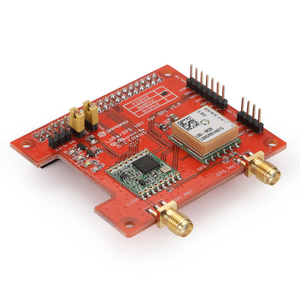
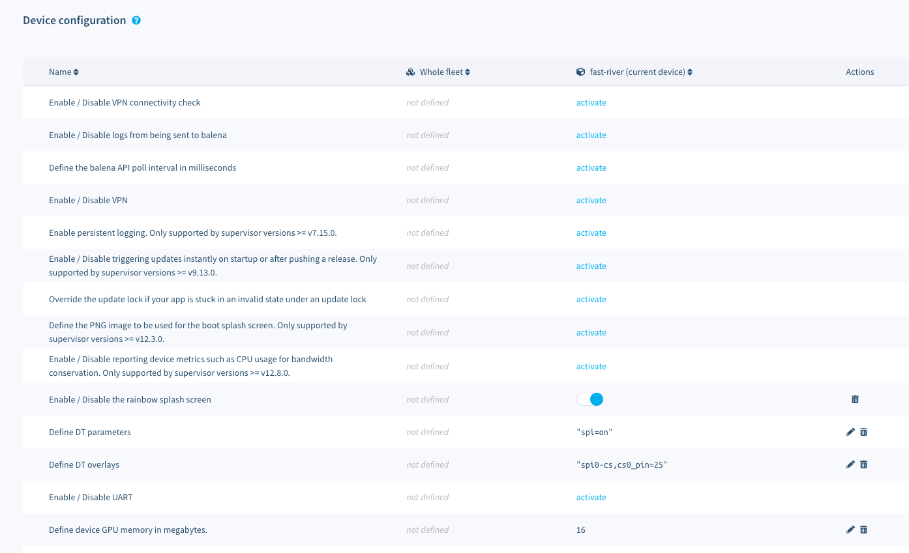

# Balena LoRa Node



TODO ...

## Configuration

### DT configuration



## Useful commands

```sh
ls -l /dev/spi*
```

## Misc

* [Dragino Lora/GPS HAT](https://wiki.dragino.com/index.php?title=Lora/GPS_HAT)
* [spidev-test](https://github.com/rm-hull/spidev-test)
* [SPI Configuration](https://github.com/mayeranalytics/pySX127x/issues/21#issuecomment-444596565)
* [How to add Dragino Lora/gps HAT to V3](https://www.thethingsnetwork.org/forum/t/how-to-add-dragino-lora-gps-hat-to-v3/48120)

## Credits

TODO ...
